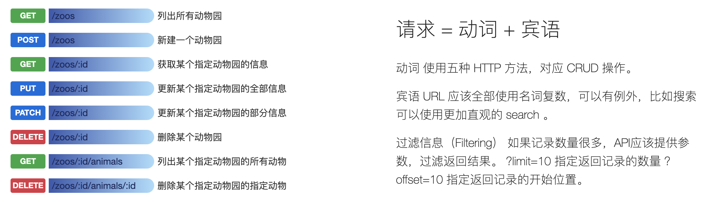

# 一 项目 & 作者
### 1 项目简介 & 愿景
```
1）项目名称
mi_shop_web，仿 小米商城（web版） 。

2）技术栈
前端为 React + JS + less 等；
后端为 Go语言 + Gin框架 + MySQL + Nginx 等。

3）目标人群
在校大学生
|| 缺少一定实战（特别是全栈开发）经验的
|| 非科班、急需项目实战的。

4）项目愿景
希望通过该项目的开源、大家认真学习后，
能有所收获与提升~
```


### 2 个人简介
```
20届本科生。
曾在滴滴等公司实习，
现是1名百度工程师（主攻前端，偶尔写点后端）。

在校期间，全权负责前、后端的项目，
分别在 2019年的微信小程序应用开发赛 获 全国三等奖 ；
CODA比赛为 前 17/211 强，并获 优秀团队 称号 等。
```


# 二 代码库介绍
### 1 前端代码库
```
1）mi_shop_web/mi_shop_fe 文件夹里 放的就是整个项目的前端代码。
```

### 2 后端代码库
```
1）mi_shop_web/mi_shop_rd 文件夹里 放的就是整个项目的后端代码。
```

# 三 前端相关
### 1 代码结构说明
```
暂时跳过，待补充。
```


# 四 后端相关
### 1 代码结构说明
```
暂时跳过，待补充。
```
### 2 数据库（MySQL）
```
1）选型
使用utf8mb4 而不是 utf8 && 使用VARCHAR 而不是 CHAR：
https://www.cnblogs.com/beyang/p/7580814.html

使用 InnoBD引擎 而不是 MyISAM（理由：体验事务操作）：
https://segmentfault.com/a/1190000019263351
https://www.runoob.com/w3cnote/mysql-different-nnodb-myisam.html

2）建表
注：组合主键、外键等暂时不加，一切先从简。

2.1） users 表 —— 用户表
DROP TABLE IF EXISTS `users`;
CREATE TABLE `users` (
  `id` varchar(255) NOT NULL,
  `name` varchar(255) NOT NULL,
  `balance` int(8) NOT NULL,
  PRIMARY KEY (`id`),
) ENGINE = InnoDB DEFAULT CHARSET = utf8mb4;


2.2） goods 表 —— 商品表
DROP TABLE IF EXISTS `goods`;
CREATE TABLE `goods` (
  `id` varchar(255) NOT NULL,
  `name` varchar(255) NOT NULL,
  `description` varchar(255) NOT NULL,
  `src` varchar(255) NOT NULL,
  `price` int(8) NOT NULL,
  `num` int(8) NOT NULL COMMENT `当前商品剩余可购买的数量`,
  PRIMARY KEY (`id`),
) ENGINE = InnoDB DEFAULT CHARSET = utf8mb4;


2.3） collects 表 —— 收藏表
DROP TABLE IF EXISTS `collects`;
CREATE TABLE `collects` (
  `userId` varchar(255) NOT NULL,
  `goodId` varchar(255) NOT NULL,
) ENGINE = InnoDB DEFAULT CHARSET = utf8mb4;


2.4） carts 表 —— 购物车表
DROP TABLE IF EXISTS `carts`;
CREATE TABLE `carts` (
  `userId` varchar(255) NOT NULL,
  `goodId` varchar(255) NOT NULL,
  `num` int(8) NOT NULL,
) ENGINE = InnoDB DEFAULT CHARSET = utf8mb4;


2.5） orders 表 —— 订单表
DROP TABLE IF EXISTS `orders`;
CREATE TABLE `orders` (
  `id` varchar(255) NOT NULL,
  `userId` varchar(255) NOT NULL,
  PRIMARY KEY (`id`),
) ENGINE = InnoDB DEFAULT CHARSET = utf8mb4;


2.6） orderGoods 表 —— 订单商品表
DROP TABLE IF EXISTS `orderGoods`;
CREATE TABLE `orderGoods` (
  `orderId` varchar(255) NOT NULL,
  `goodId` varchar(255) NOT NULL,
  `num` int(8) NOT NULL,
) ENGINE = InnoDB DEFAULT CHARSET = utf8mb4;


2.7） addresss 表 —— 订单商品表
DROP TABLE IF EXISTS `addresss`;
CREATE TABLE `addresss` (
  `userId` varchar(255) NOT NULL,
  `name` varchar(255) NOT NULL,
  `address` varchar(255) NOT NULL,
  `phone` varchar(255) NOT NULL,
) ENGINE = InnoDB DEFAULT CHARSET = utf8mb4;


3）插入测试数据
暂时跳过，待补充。
```

### 2 Yapi
```
1）用途
用于mock接口数据。

2）项目的Yapi地址
http://yapi.smart-xwork.cn/project/90441/interface/api/1303423
```


# 五 接口说明
### 1 架构风格 & 设计风格
```
REST 是 Representational State Transfer的缩写，如果一个架构符合REST原则，就称它为RESTful架构。

RESTful 架构可以充分的利用 HTTP 协议的各种功能，是 HTTP 协议的最佳实践。

RESTful API 是一种软件架构风格、设计风格，可以让软件更加清晰，更简洁，更有层次，可维护性更好。


参考：
1）https://restfulapi.cn
```



### 2 返回值
```
1）一般性说明
以 GET /users/:userId 为例。

1.1）若 处理成功 时，
则 Status Code = 200；数据返回一个对象，结构如下：
{
  "code": 0,
  "message": "",
  "requestId": "x-xx-xxx",
  "data": {
    "id": "0",
    "name": "码农三少",
    "balance": 100000
  }
}


1.2）若 处理失败 时，
则 Status Code != 200（一般是 [400, 500] ）；数据返回一个对象，结构如下：
{
  "code": -1, // 非0的任何整数值
  "message": "xxx", // 失败时，message不可为空字符串 —— 用于说明错误的原因（尽量是枚举值）。
  "requestId": "x-xx-xxx", // 失败时，requestId不可为空字符串 —— 用于排查日志、定位错误。
  "data": {
      
  }, // code为非0时，data数据不可使用！
}
```